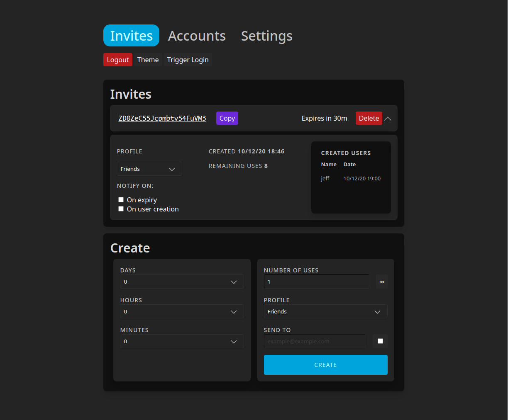
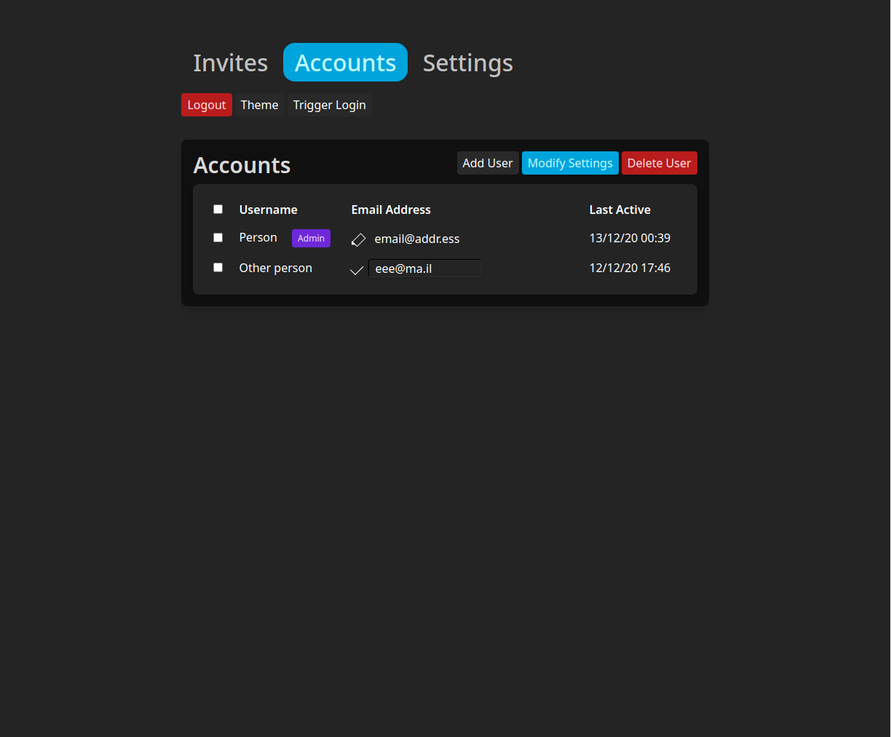
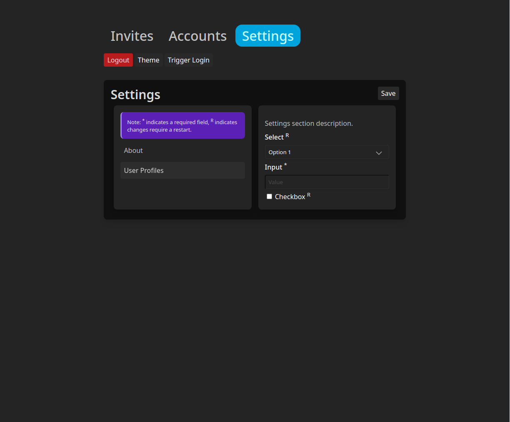
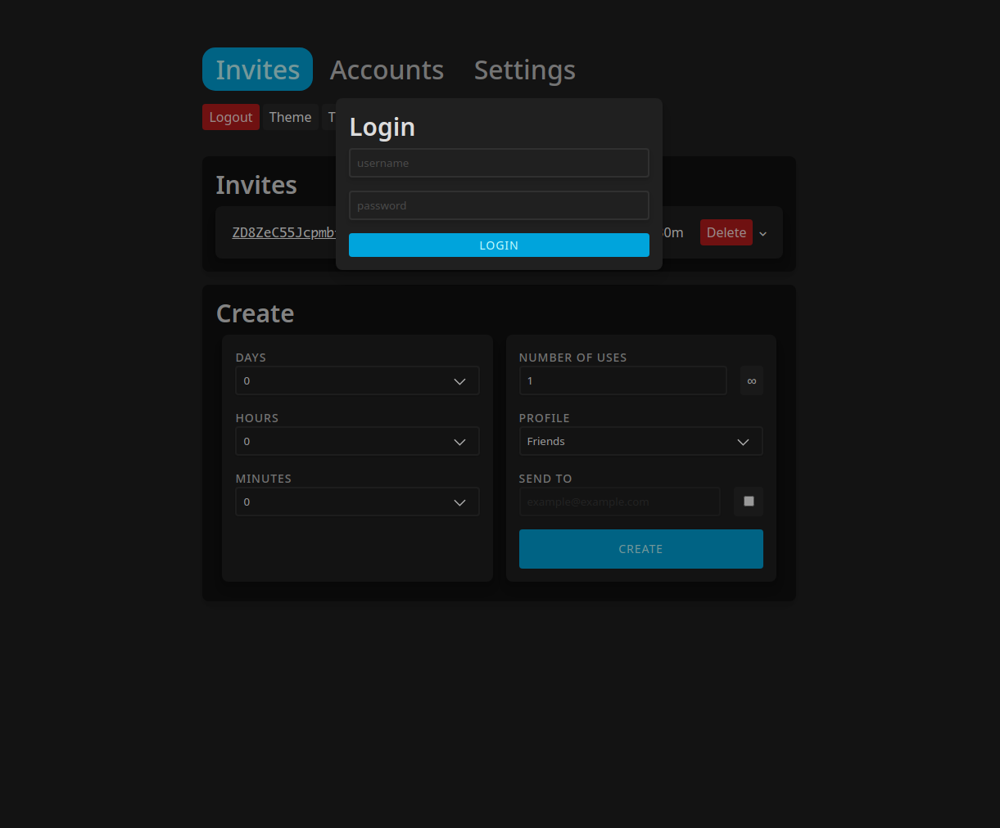
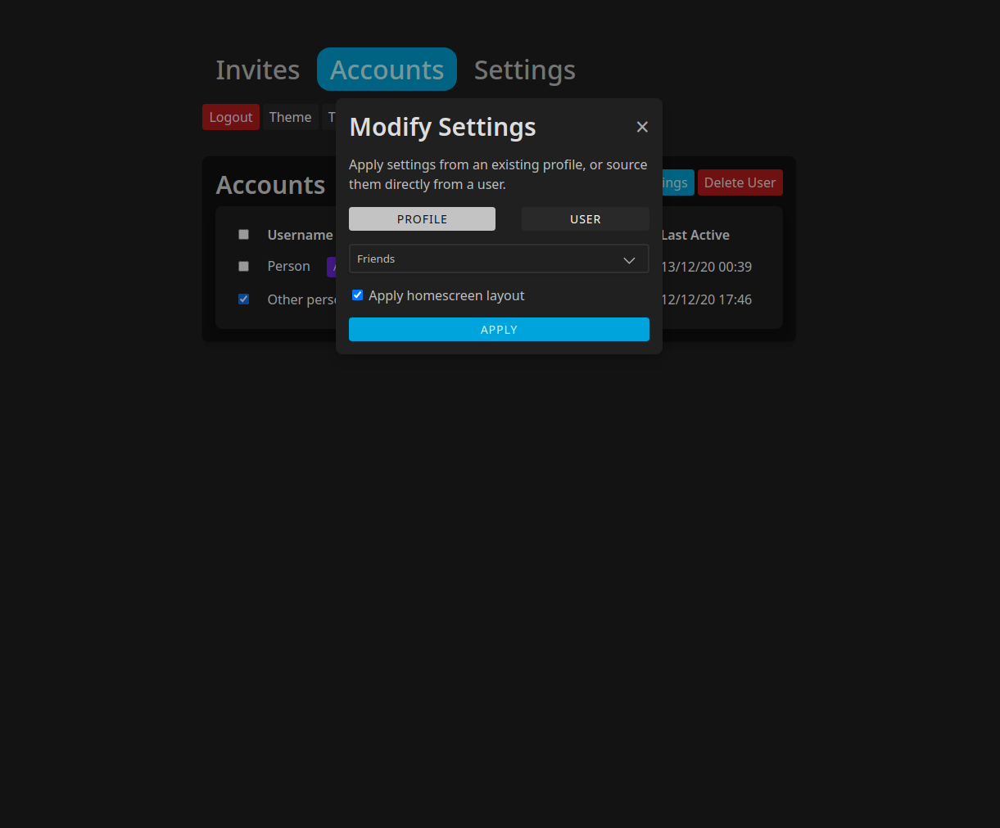
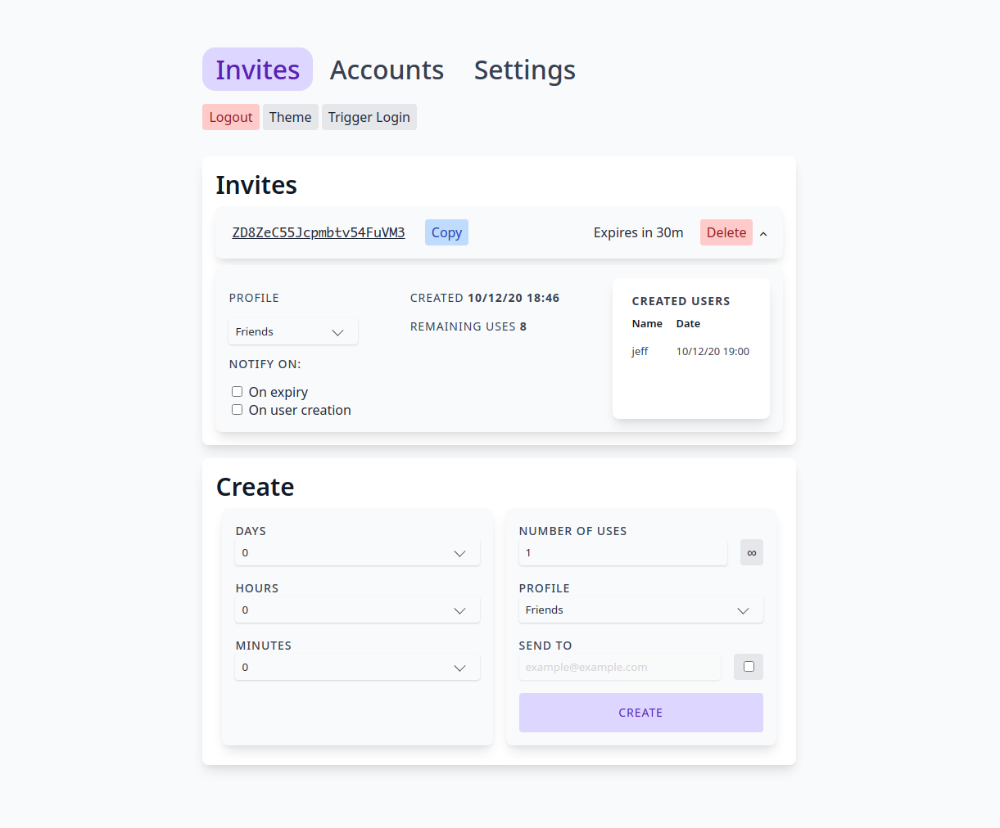
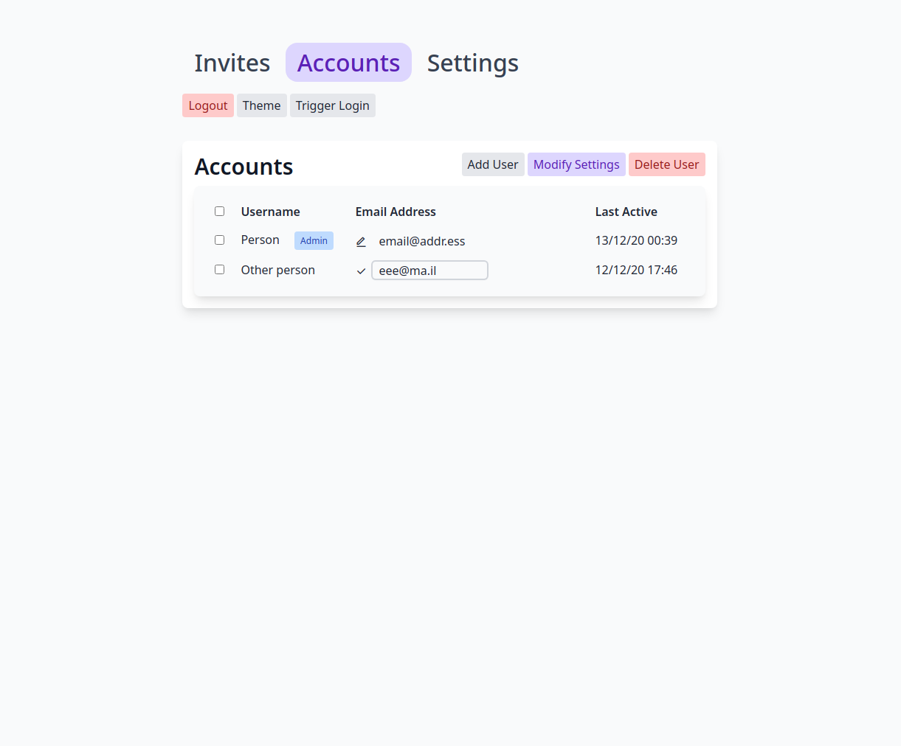
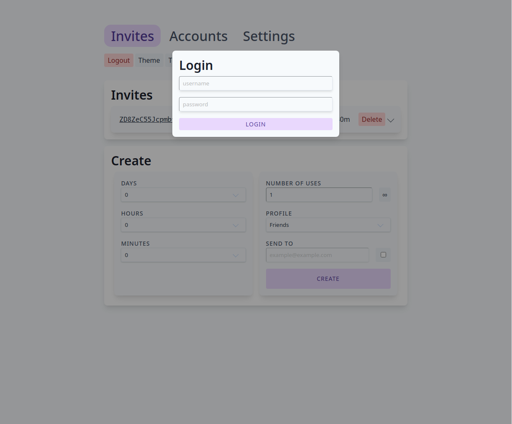

This branch is for experimenting with [a17t](https://a17t.miles.land/) to possibly replace bootstrap in the future. Currently just working on the page structures, so none of this is actually usable in jfa-go yet.

#### todo
**general**
* [x] modal implementation
* [x] animations
* [x] utilities
* [x] CSS for light & dark

**admin**
* [x] invites tab
* [x] accounts tab
* [x] settings tab
* [x] modals
* [ ] integration with existing code

**invites**
* [ ] everything

#### screenshots
##### dark

    
    
    
    
    

##### light

    
    
    
    
    

