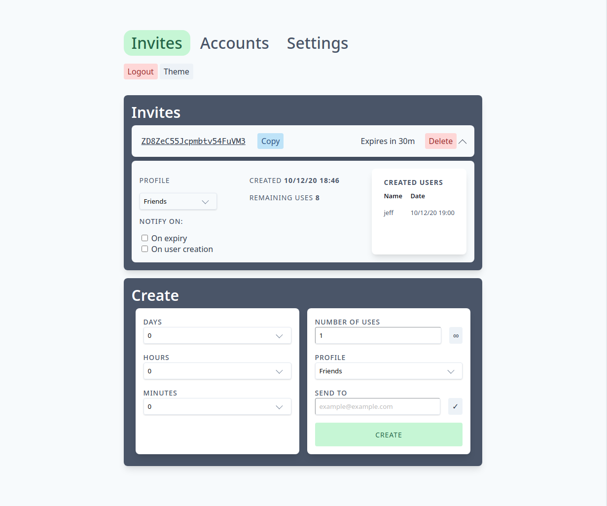
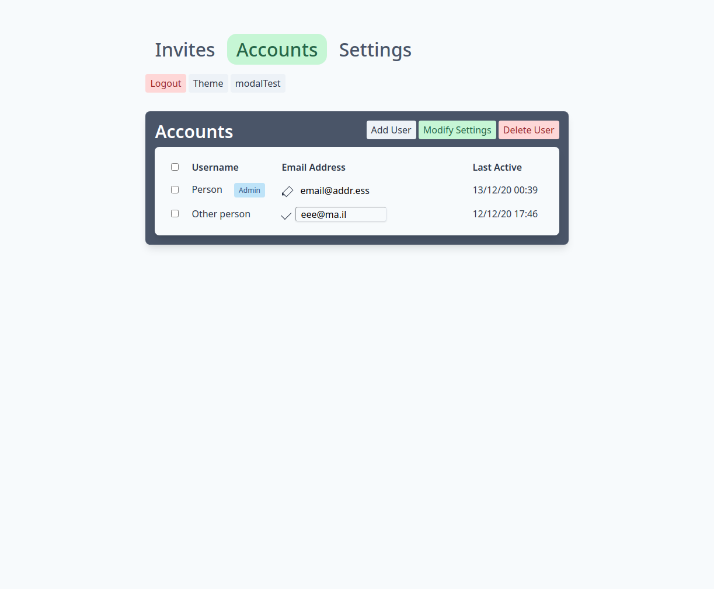
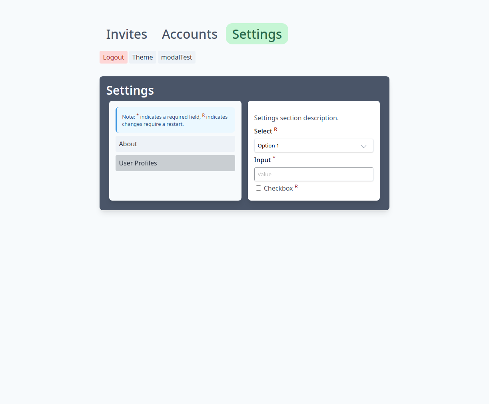

This branch is for experimenting with [a17t](https://a17t.miles.land/) to possibly replace bootstrap in the future. Currently just working on the page structures, so none of this is actually usable in jfa-go yet.

#### currently done:
* [x] invites tab mockup (partially complete)
* [x] accounts tab mockup
* [x] settings tab mockup
* [ ] modals (may not use them at all, who knows)
* [ ] animations

#### screenshots

    
    
    

